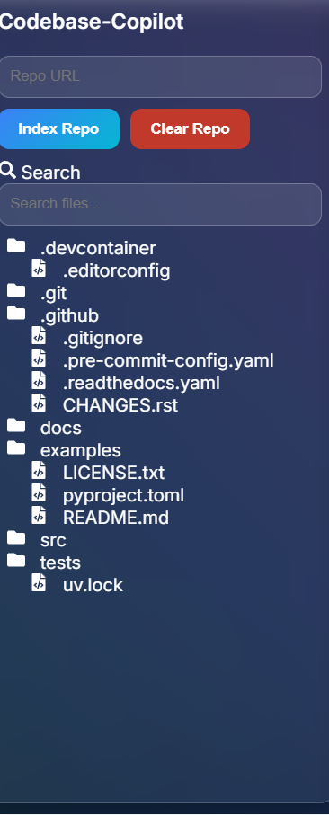
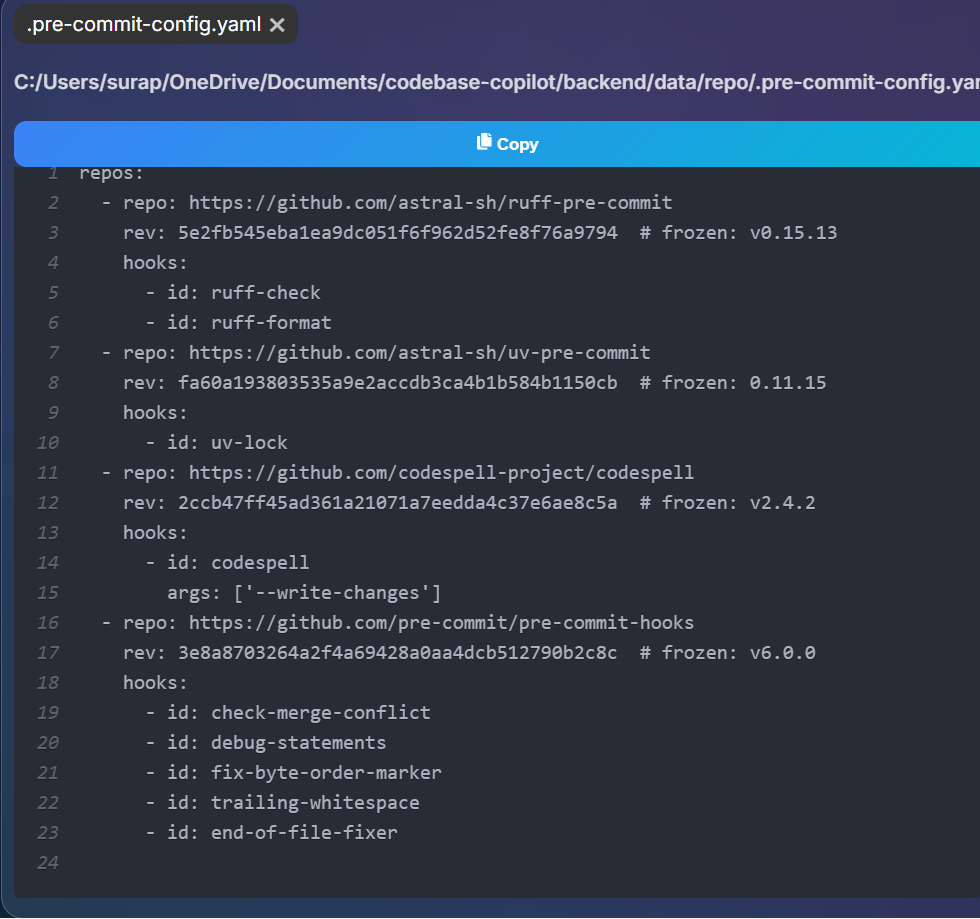

# 🚀 Codebase Copilot

An AI-powered codebase exploration and repository analysis tool that helps developers understand unfamiliar projects instantly.

Codebase Copilot clones a GitHub repository, indexes its source code using vector embeddings, and allows users to ask natural language questions about the codebase.

---

## ✨ Features

### 📂 Repository Indexing

- Clone any public GitHub repository
- Automatically scan project files
- Extract and chunk source code
- Generate semantic embeddings
- Store vectors in FAISS

### 🔍 Smart Code Search

- Semantic code retrieval
- Keyword-enhanced search
- Fast similarity matching
- Context-aware code lookup

### 🤖 AI Code Assistant

- Ask questions about the repository
- Understand project architecture
- Explain functions and classes
- Locate important files
- Analyze implementation details

### 📁 File Explorer

- Browse repository structure
- Open files directly in the UI
- Syntax-highlighted code viewer
- Multi-tab support

### 💬 Conversational Memory

- Maintains recent chat history
- Supports follow-up questions
- Context-aware responses

### 🗑️ Repository Management

- Clear indexed repositories
- Remove vector database
- Reset chat history

---

## 🏗️ Architecture

```text
GitHub Repository
        │
        ▼
 Repository Cloner
        │
        ▼
   Code Reader
        │
        ▼
    Chunker
        │
        ▼
 SentenceTransformer
        │
        ▼
      FAISS
        │
        ▼
 Semantic Search
        │
        ▼
   Local LLM
        │
        ▼
   User Response
```

---

## 🛠️ Tech Stack

### Frontend

- React
- Vite
- Axios
- React Icons
- React Syntax Highlighter

### Backend

- FastAPI
- FAISS
- Sentence Transformers
- GitPython
- Ollama

### AI Models

- all-MiniLM-L6-v2 (Embeddings)
- Qwen 2.5 1.5B (Local LLM)

---

## 📦 Installation

### Clone Repository

```bash
git clone https://github.com/akhil2328/codebase-copilot.git
cd codebase-copilot
```

---

## Backend Setup

```bash
cd backend

python -m venv venv

# Windows
venv\Scripts\activate

pip install -r requirements.txt
```

Install Ollama:

```bash
ollama pull qwen2.5:1.5b
```

Run backend:

```bash
python -m uvicorn main:app
```

Backend runs at:

```text
http://127.0.0.1:8000
```

---

## Frontend Setup

```bash
cd frontend

npm install
npm run dev
```

Frontend runs at:

```text
http://127.0.0.1:5173
```

---

## Usage

### Step 1

Paste a GitHub repository URL.

Example:

```text
https://github.com/pallets/flask
```

### Step 2

Click **Index Repo**.

### Step 3

Browse files in the file explorer.

### Step 4

Ask questions such as:

```text
What is the project architecture?

How are routes implemented?

Where is the Flask application created?

Explain the authentication flow.
```

### Step 5

Use **Clear Repo** to remove the indexed repository and vector database.

---

## API Endpoints

### Index Repository

```http
POST /index
```

### Ask Question

```http
GET /ask
```

### Streaming Response

```http
GET /ask-stream
```

### List Files

```http
GET /files
```

### Read File

```http
GET /file
```

### Status

```http
GET /status
```

### Debug

```http
GET /debug
```

### Clear Repository

```http
DELETE /clear
```

---

## Screenshots

### Dashboard



### Repository Explorer



### AI Assistant


## Future Improvements

- Multi-repository support
- Repository comparison
- Pull request analysis
- Commit history understanding
- Code summarization
- Dependency graph visualization
- Cloud deployment

---

## Author

** Chandra Akhileshwara Reddy**

GitHub:
https://github.com/akhil2328

---
